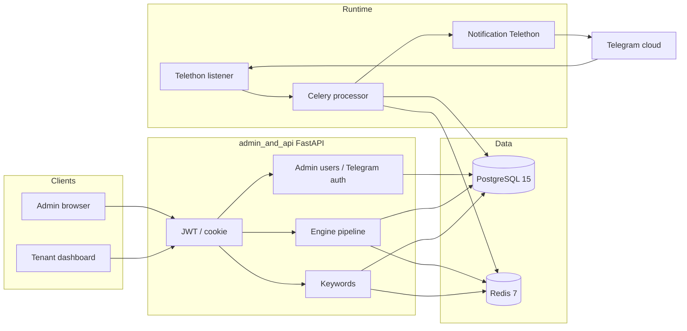
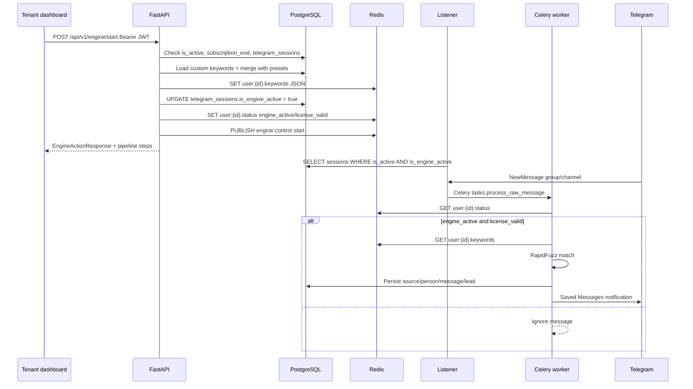
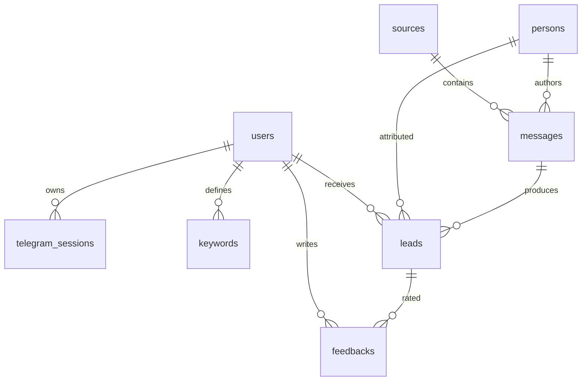
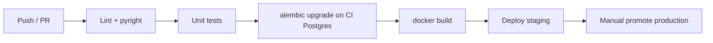

# Technical Specification & Architecture Document

**Product:** Telegram Opportunity Detection & Lead Intelligence  
**Codebase:** `self-bot`  
**Version:** 0.1.0  
**Document status:** Production-grade specification aligned with the current modular monolith  
**Primary language of the product UI:** Persian (RTL admin and tenant dashboards)

---

## 1. System Overview

### 1.1 Executive summary

Sales and agency teams miss buying-intent messages buried in Telegram groups and channels. This system is a **multi-tenant, event-driven SaaS** that:

1. Authenticates a tenant’s Telegram account (Pyrogram string session stored in PostgreSQL).
2. Lets the tenant **start/stop a listening engine** from `/dashboard`, gated by account `is_active` and subscription (`users.subscription_end`).
3. Ingests group/channel messages (Telethon listener) and enqueues them for matching (Celery + Redis).
4. Scores matches as **low / warm / hot** leads (RapidFuzz + keyword presets + custom keywords).
5. Persists leads and notifies the tenant via Telegram **Saved Messages**.

The runtime is a **modular monolith**: one Python repository, four bounded modules (`listener`, `processor`, `notification`, `admin_and_api`), shared ORM (`shared/models.py`), and Redis as broker, cache, and control plane.

### 1.2 Stakeholders

| Stakeholder | Role |
|-------------|------|
| Platform operator (admin) | Creates tenants, attaches Telegram sessions, renews licenses, views active sessions |
| Tenant (dashboard user) | Logs in, manages custom keywords, starts/stops the engine, receives lead alerts |
| Operations | Runs Postgres 15, Redis 7, Uvicorn API, Celery worker, Telethon listener |
| Telegram (external) | Source of messages; destination of Saved Messages notifications |

### 1.3 Scope

**In scope**

- JWT + HttpOnly cookie authentication; bcrypt password hashing  
- Admin HTML panels (`/`, `/users`, `/sessions`) and tenant dashboard (`/dashboard`)  
- Keyword presets by `business_type` + per-user custom keywords + Redis merge cache  
- Engine start/stop/status pipeline (Redis status, session `is_engine_active`, control pub/sub)  
- Lead matching, PostgreSQL persistence path, Telethon notification  

**Out of scope (current codebase)**

- Kubernetes manifests and GitHub Actions (not present; specified as target strategy in §6)  
- Full lead list/feedback API (placeholders still raise `NotImplementedError`)  
- True microservices split and multi-region HA  

### 1.4 Technical objectives

| ID | Objective | Mechanism |
|----|-----------|-----------|
| T1 | Isolate tenants | `user_id` FKs; Redis keys `user:{id}:*` |
| T2 | Fast keyword evaluation | Merged list in Redis; Celery worker reads cache before DB |
| T3 | License-gated ingest | `subscription_end`; Redis `license_valid`; engine start rejects expired licenses |
| T4 | Operator control of Telegram identity | Admin Telegram send-code / verify-code → `telegram_sessions` |
| T5 | Observable engine | Pipeline steps + Redis pipeline log + service heartbeats |

---

## 2. Architecture & Design

### 2.1 Style

**Modular monolith** (not microservices):

- **Process split** (same image, different commands): API (`uvicorn`), listener (`python -m modules.listener.app`), processor (`python -m modules.processor.worker`).  
- **Shared library layers:** `core/` (config, DB, Redis, JWT), `shared/` (ORM + enums).  
- **No service mesh.** Coupling is via PostgreSQL, Redis keys/channels, and Celery tasks.

### 2.2 High-level architecture



### 2.3 Control and data sequence (engine start → first lead)



### 2.4 Logical layers

| Layer | Location | Responsibility |
|-------|----------|----------------|
| Presentation | `modules/admin_and_api/templates/` | Jinja2 + Tailwind CDN + fetch() |
| HTTP / application | FastAPI routers | Auth, admin, keywords, engine, licenses |
| Domain / matching | `modules/processor/matching.py` | Keyword rules, lead level |
| Integration | Telethon / Pyrogram | Ingest and notify |
| Persistence | SQLAlchemy 2 async + Alembic | Canonical tenant data |
| Cache / bus | Redis RESP2 | Keywords, engine status, pub/sub, Celery broker |

### 2.5 Directory / folder structure

```text
self-bot/
├── alembic.ini
├── alembic/
│   ├── env.py
│   └── versions/
│       ├── 3fe7d1a5aca7_initial_tables.py
│       ├── a1b2c3d4e5f6_add_dashboard_password.py
│       └── b2c3d4e5f6a7_add_is_engine_active.py
├── config/presets/                 # Default keywords per business_type
│   ├── programmer.json
│   ├── web_designer.json
│   ├── seo_specialist.json
│   └── real_estate.json
├── core/
│   ├── config.py                   # Pydantic Settings
│   ├── database.py                 # async engine / session
│   ├── cache.py                    # Redis keys, status, pub/sub
│   ├── security.py                 # bcrypt + JWT
│   └── logger.py
├── shared/
│   ├── models.py                   # User, TelegramSession, Keyword, Source, Person, Message, Lead, Feedback
│   └── enums.py
├── modules/
│   ├── listener/                   # Telethon ingest
│   │   ├── app.py
│   │   ├── auth.py
│   │   ├── handlers.py
│   │   └── producer.py
│   ├── processor/                  # Celery matching
│   │   ├── worker.py
│   │   ├── tasks.py
│   │   ├── matching.py
│   │   ├── nlp.py
│   │   ├── persist.py
│   │   └── presets.py
│   ├── notification/
│   │   ├── sender.py
│   │   └── formatter.py
│   └── admin_and_api/
│       ├── main.py
│       ├── deps.py
│       ├── schemas.py
│       ├── engine_pipeline.py
│       ├── routers/                # auth, admin, keywords, engine, licenses, telegram_auth, users, leads
│       └── templates/              # login, dashboard, admin index/users/sessions
├── creat-admin.py
├── docker-compose.yml
├── Dockerfile
├── requirements.txt
└── doc/                            # This specification and related notes
```

---

## 3. Database & Data Modeling

### 3.1 Entity-relationship overview



**Multi-tenancy:** Tenant isolation is `users.id`. Keywords, sessions, and leads always belong to a user. `sources` / `persons` / `messages` are global Telegram identities reused across tenants (shared graph), while `leads.user_id` attributes the opportunity to a paying tenant.

### 3.2 Data flow (operational)

1. Admin creates `users` and optionally a `telegram_sessions` row (session string).  
2. Tenant custom keywords live in `keywords`; defaults live in JSON presets, not in SQL.  
3. Engine start sets `telegram_sessions.is_engine_active`.  
4. On match, processor upserts `sources` + `persons`, inserts `messages` + `leads`.  
5. `feedbacks` is reserved for future quality loop (API not implemented).

### 3.3 Schema breakdown

PostgreSQL enums (Alembic): `keywordtypeenum`, `leadlevelenum`, `feedbacktypeenum`.

#### `users`

| Field | Type | Description | Constraints |
|-------|------|-------------|-------------|
| id | INTEGER | Tenant PK | PK, identity |
| telegram_id | BIGINT | Telegram user id from `get_me` | UNIQUE, nullable |
| username | VARCHAR(100) | Login id (often phone) | nullable |
| hashed_password | VARCHAR(255) | bcrypt | nullable |
| full_name | VARCHAR(100) | Display name | nullable |
| business_type | VARCHAR(100) | Preset pack key | nullable |
| is_active | BOOLEAN | Account enabled | NOT NULL, default true |
| is_admin | BOOLEAN | Operator flag | NOT NULL, default false |
| dashboard_password | VARCHAR(128) | Plain password for admin display (non-admin) | nullable |
| subscription_end | TIMESTAMPTZ | License expiry | nullable |
| created_at | TIMESTAMPTZ | Created | server default now() |

#### `telegram_sessions`

| Field | Type | Description | Constraints |
|-------|------|-------------|-------------|
| id | INTEGER | PK | PK |
| user_id | INTEGER | Owner | FK users.id ON DELETE CASCADE, NOT NULL |
| phone_number | VARCHAR(20) | Telegram phone | NOT NULL |
| session_string | TEXT | Telethon/Pyrogram session | NOT NULL |
| is_active | BOOLEAN | Session usable | NOT NULL, default true |
| is_engine_active | BOOLEAN | Listener should bind this account | NOT NULL, default false |
| created_at | TIMESTAMPTZ | Created | server default now() |

#### `keywords`

| Field | Type | Description | Constraints |
|-------|------|-------------|-------------|
| id | INTEGER | PK | PK |
| user_id | INTEGER | Owner | FK CASCADE, indexed |
| word | VARCHAR(100) | Custom phrase | NOT NULL |
| type | ENUM | positive / negative | NOT NULL |
| weight | FLOAT | Match weight | default 1.0 |
| created_at | TIMESTAMPTZ | Created | server default now() |

#### `sources`

| Field | Type | Description | Constraints |
|-------|------|-------------|-------------|
| id | INTEGER | PK | PK |
| telegram_chat_id | BIGINT | Chat id | UNIQUE, NOT NULL |
| title | VARCHAR(255) | Group title | nullable |
| username | VARCHAR(100) | @username | nullable |
| source_score | FLOAT | Source quality | default 50 |
| is_active | BOOLEAN | Monitored | default true |
| created_at | TIMESTAMPTZ | Created | server default now() |

#### `persons`

| Field | Type | Description | Constraints |
|-------|------|-------------|-------------|
| id | INTEGER | PK | PK |
| telegram_user_id | BIGINT | Sender id | UNIQUE, NOT NULL |
| username | VARCHAR(100) | @username | nullable |
| first_name / last_name | VARCHAR(100) | Profile | nullable |
| phone | VARCHAR(20) | Phone | nullable |
| topic_profile | JSONB | Future ML profile | NOT NULL default `{}` |
| updated_at | TIMESTAMPTZ | Last update | server default now() |

#### `messages`

| Field | Type | Description | Constraints |
|-------|------|-------------|-------------|
| id | INTEGER | PK | PK |
| telegram_message_id | BIGINT | Telegram message id | NOT NULL |
| source_id | INTEGER | Chat | FK sources CASCADE |
| person_id | INTEGER | Author | FK persons CASCADE |
| raw_text | TEXT | Body | NOT NULL |
| message_date | TIMESTAMPTZ | Telegram date | NOT NULL |
| created_at | TIMESTAMPTZ | Ingest time | server default now() |

#### `leads`

| Field | Type | Description | Constraints |
|-------|------|-------------|-------------|
| id | INTEGER | PK | PK |
| user_id | INTEGER | Tenant | FK users CASCADE, indexed |
| message_id | INTEGER | Source message | FK messages CASCADE |
| person_id | INTEGER | Author | FK persons CASCADE |
| intent_score | FLOAT | Match score | NOT NULL |
| lead_level | ENUM | low / warm / hot | NOT NULL |
| evidence_json | JSONB | Keywords, chat metadata | NOT NULL |
| created_at | TIMESTAMPTZ | Created | server default now() |

#### `feedbacks`

| Field | Type | Description | Constraints |
|-------|------|-------------|-------------|
| id | INTEGER | PK | PK |
| lead_id | INTEGER | Lead | FK leads CASCADE |
| user_id | INTEGER | Rater | FK users CASCADE |
| rating | ENUM | relevant / irrelevant / not_sure | NOT NULL |
| notes | TEXT | Comment | nullable |
| created_at | TIMESTAMPTZ | Created | server default now() |

### 3.4 Redis data model (not SQL)

| Key / channel | Type | Payload |
|---------------|------|---------|
| `user:{id}:keywords` | STRING JSON | `final_keywords`, `default_keywords`, `custom_keywords`, `negative_keywords` |
| `user:{id}:status` | STRING JSON | `{ "engine_active": bool, "license_valid": bool }` |
| `user:{id}:pipeline_log` | LIST JSON | Engine pipeline steps (capped) |
| `engine:control` | PUBSUB | `{ "action": "start"\|"stop", "user_id", "ts" }` |
| `service:listener:heartbeat` | STRING | Listener liveness |
| `service:processor:heartbeat` | STRING | Worker liveness |
| Celery broker | Redis DB | Task queues |
| `queue:raw_messages` | LIST (optional) | Alternate ingest queue name via `REDIS_QUEUE_NAME` |

---

## 4. API / Interface Reference

**Base URL:** `http://127.0.0.1:8000`  
**Interactive docs:** `/docs` (OpenAPI)  
**Auth:** `Authorization: Bearer <access_token>` except register/login. HTML admin routes also use HttpOnly cookie `access_token`.

### 4.1 HTML routes (not in OpenAPI)

| Method | Path | Audience | Notes |
|--------|------|----------|-------|
| GET | `/login` | All | Login form |
| GET | `/dashboard` | Tenant | Keywords + engine card |
| GET | `/`, `/admin` | Admin | Cookie gate; Telegram connect + create user |
| GET | `/users` | Admin | User table + edit modal |
| GET | `/sessions` | Admin | Active `telegram_sessions` |

**Admin HTML status:** missing cookie → `admin_gate.html`; non-admin → `access_denied.html`.

### 4.2 Authentication — `/api/v1/auth`

| Method | Path | Auth | Status | Description |
|--------|------|------|--------|-------------|
| POST | `/register` | No | 201 / 400 | Create user |
| POST | `/login` | No | 200 / 401 | OAuth2 password form; JWT + cookie |
| POST | `/logout` | No | 200 | Clear cookie |
| POST | `/sync-cookie` | Bearer | 200 | Copy Bearer into cookie |
| GET | `/me` | Bearer active | 200 / 401 | Profile including `business_type` |

**Login request:** `application/x-www-form-urlencoded`

```http
POST /api/v1/auth/login
Content-Type: application/x-www-form-urlencoded

username=0912...&password=secret12
```

**Login response `200`:**

```json
{
  "access_token": "<jwt>",
  "token_type": "bearer"
}
```

**Error `401`:** `{ "detail": "Incorrect username or password" }`

### 4.3 Keywords — `/api/v1/keywords`

| Method | Path | Auth | Status | Description |
|--------|------|------|--------|-------------|
| GET | `/` | Active user | 200 | Bundle: default + custom + final |
| POST | `/` | Active user | 201 / 400 | Custom keyword `{ "text": "رهن" }` |
| PUT | `/{keyword_id}` | Owner | 200 / 404 | Update |
| DELETE | `/{keyword_id}` | Owner | 204 / 404 | Delete + Redis resync |

**GET response (sample):**

```json
{
  "business_type": "real_estate",
  "default_keywords": ["فروش آپارتمان", "رهن", "اجاره"],
  "custom_keywords": [
    {
      "id": 12,
      "word": "پیش‌فروش",
      "type": "positive",
      "weight": 1.0,
      "created_at": "2026-08-29T10:00:00+00:00"
    }
  ],
  "final_keywords": ["فروش آپارتمان", "رهن", "اجاره", "پیش‌فروش"]
}
```

Side effect: writes `user:{id}:keywords`.

### 4.4 Engine — `/api/v1/engine`

Depends on `get_current_user` (JWT required; start additionally enforces `is_active` and license).

| Method | Path | Status | Description |
|--------|------|--------|-------------|
| POST | `/start` | 200 / 400 / 403 | Merge keywords, Redis status, `is_engine_active=true`, pub/sub |
| POST | `/stop` | 200 | `engine_active=false`, `is_engine_active=false` |
| GET | `/status` | 200 | Live flags, keyword_count, days_remaining, indicator |
| GET | `/pipeline` | 200 | Recent pipeline log from Redis |

**`indicator`:** `listening` | `stopped` | `expired`

**POST `/start` error `403`:**

```json
{ "detail": "لایسنس منقضی شده یا تعریف نشده است." }
```

**POST `/start` error `400`:**

```json
{ "detail": "سشن تلگرام برای این کاربر یافت نشد." }
```

**GET `/status` sample:**

```json
{
  "engine_active": true,
  "license_valid": true,
  "keyword_count": 8,
  "days_remaining": 22,
  "license_expires_at": "2026-09-20T12:00:00+00:00",
  "indicator": "listening"
}
```

Start/stop return the same fields plus `pipeline: EnginePipelineStep[]`.

### 4.5 Licenses — `/api/v1/licenses`

| Method | Path | Auth | Description |
|--------|------|------|-------------|
| GET | `/status` | Active user | `is_valid`, `days_remaining`, `subscription_end` |
| POST | `/renew` | Admin | `{ "user_id": 3, "extra_days": 30 }` |

### 4.6 Admin — `/api/v1/admin`

All require `is_admin`.

| Method | Path | Status | Description |
|--------|------|--------|-------------|
| GET | `/users` | 200 | All users + `dashboard_password` (non-admin) |
| POST | `/users` | 201 | Create: full_name, phone_number, password, business_type, license days/date |
| PUT | `/users/{id}` | 200 | Partial update; sync session `is_active` with user flag |
| PATCH | `/users/{id}/toggle-active` | 200 | Flip `is_active`; sync all `telegram_sessions.is_active` |
| POST | `/users/{id}/renew-license` | 200 | `{ "days": 30 }` |
| DELETE | `/users/{id}` | 204 | Non-admin only; not self |
| GET | `/telegram-sessions` | 200 | Active sessions + owner |
| GET | `/sessions` | 200 | Alias (hidden from schema) |

**POST `/users` sample:**

```json
{
  "full_name": "علی رضایی",
  "phone_number": "+989123456789",
  "password": "secret12",
  "business_type": "real_estate",
  "license_duration_days": 30
}
```

### 4.7 Telegram connection — `/api/v1/telegram` (admin)

| Method | Path | Description |
|--------|------|-------------|
| POST | `/send-code` | `{ "phone_number": "+98..." }` → `phone_code_hash` |
| POST | `/verify-code` | Requires `user_id`; upserts `telegram_sessions` |

### 4.8 Other

| Prefix | Notes |
|--------|--------|
| GET `/api/v1/users/` | Admin list `UserResponse` |
| `/api/v1/leads` | **Not implemented** — raises `NotImplementedError` |

### 4.9 Common HTTP codes

| Code | Meaning |
|------|---------|
| 200 / 201 / 204 | Success |
| 400 | Validation / business rule (duplicate phone, no session) |
| 401 | Missing/invalid JWT or inactive user (`get_current_active_user`) |
| 403 | Not admin, or engine start license/account failure |
| 404 | User or keyword not found |
| 422 | Pydantic validation |
| 500 | Telegram API misconfig (`TELEGRAM_API_ID` missing) |

---

## 5. Configuration & Environment

Loaded by `core.config.Settings` from `.env` (`extra="ignore"`).

| Variable | Default | Production guidance |
|----------|---------|---------------------|
| `APP_ENV` | `development` | `production` (enables Secure cookie) |
| `LOG_LEVEL` | `INFO` | `INFO` or `WARNING` |
| `SECRET_KEY` | `changeme` | **Required:** long random secret; rotate on compromise |
| `ALGORITHM` | `HS256` | Keep HS256 unless moving to RS256/JWKS |
| `ACCESS_TOKEN_EXPIRE_MINUTES` | `60` | 15–60; shorter for high-risk tenants |
| `POSTGRES_USER` | `telegram_listener` | Dedicated role, least privilege |
| `POSTGRES_PASSWORD` | `changeme` | Strong secret; never commit |
| `POSTGRES_DB` | `telegram_listener` | Dedicated database |
| `POSTGRES_HOST` | `localhost` | Compose: `postgres`; host apps: `127.0.0.1` |
| `POSTGRES_PORT` | `5432` | Host mapping **5433→5432** in Compose |
| `REDIS_HOST` | `127.0.0.1` | Compose: `redis` |
| `REDIS_PORT` | `6379` | |
| `REDIS_URL` | derived | Optional override `redis://host:6379/0` |
| `TELEGRAM_API_ID` | unset | From my.telegram.org |
| `TELEGRAM_API_HASH` | unset | Treat as secret |
| `REDIS_QUEUE_NAME` | `queue:raw_messages` | Listener producer |

**Derived:** `database_url` = `postgresql+asyncpg://...`  
**Derived:** `resolved_redis_url` = `REDIS_URL` or `redis://{host}:{port}/0`

**Celery worker:** also reads `REDIS_HOST` / `REDIS_PORT` / `REDIS_URL` in `modules/processor/worker.py` (RESP2 patch for older Redis).

**Production options**

- Set `APP_ENV=production` for `Secure` cookies.  
- Terminate TLS at reverse proxy (Caddy/Nginx); do not expose Uvicorn on the public internet without TLS.  
- Pin Postgres/Redis versions as in Compose (`postgres:15-alpine`, `redis:7-alpine`).  
- Run `alembic upgrade head` before rolling new app containers.  
- Seed first operator with `creat-admin.py` (change default password immediately).

---

## 6. Deployment & DevOps

### 6.1 Local / host development

```bash
python -m venv venv
.\venv\Scripts\activate          # Windows
pip install -r requirements.txt
docker compose up -d postgres redis
# Set POSTGRES_PORT=5433 in .env for host-side Alembic/Uvicorn
alembic upgrade head
python creat-admin.py
uvicorn modules.admin_and_api.main:app --reload --host 127.0.0.1 --port 8000
# Separate terminals:
python -m modules.listener.app
python -m modules.processor.worker
```

### 6.2 Docker image

`Dockerfile`: Python 3.11-slim, `libpq-dev`, `pip install -r requirements.txt`, default `CMD python`.

Compose **overrides command** per service:

| Service | Command |
|---------|---------|
| api | `uvicorn modules.admin_and_api.main:app --host 0.0.0.0 --port 8000` |
| listener | `python -m modules.listener.app` |
| processor | `python -m modules.processor.worker` |

Inside Compose, set `POSTGRES_HOST=postgres` and `REDIS_HOST=redis` in `.env`.

```bash
docker compose up -d --build
```

Healthchecks: Postgres `pg_isready`; Redis `PING`. API depends on both healthy.

**Note:** Compose healthcheck DB name may differ from `POSTGRES_DB` if env is inconsistent—keep `POSTGRES_DB` aligned with the healthcheck.

### 6.3 CI/CD (target; not in repo)

No `.github/workflows` exists today. Recommended pipeline:



**Suggested GitHub Actions jobs**

1. `pip install -r requirements.txt` + ruff/pyright  
2. Service containers: Postgres 15, Redis 7  
3. `alembic upgrade head` against CI database  
4. Build/push image to registry  
5. Deploy: Compose on a VM, or later Helm (not implemented)

### 6.4 Kubernetes (future)

Map Compose services to Deployments: `api`, `listener`, `processor`; StatefulSet or managed Postgres/Redis; Secret for `SECRET_KEY` and Telegram credentials; Ingress → API `:8000`. Listener and processor need no Ingress.

### 6.5 Backup

- Postgres: `pg_dump` volume `postgres_data`  
- Redis: AOF/RDB volume `redis_data` (keywords/status can be rebuilt from SQL + presets)  
- Session strings in `telegram_sessions` are **secrets**—encrypt backups

---

## 7. Security & Error Handling

### 7.1 Authentication & authorization

| Mechanism | Detail |
|-----------|--------|
| Password | `passlib` bcrypt; `hashed_password` in `users` |
| JWT | HS256; claims `sub` = user id, `username`; expiry from settings |
| Cookie | HttpOnly, SameSite=Lax, path `/`; Secure when `APP_ENV=production` |
| Admin | `User.is_admin`; 403 `{ "detail": "دسترسی غیرمجاز" }` |
| Active user | `get_current_active_user` → 401 Inactive |
| Engine | Start blocked if `is_active` false or `subscription_end` not in the future |

**Do not treat `dashboard_password` as a second hash.** It is plaintext for the admin table so operators can share credentials with tenants. Restrict `/admin` and `/api/v1/admin/*` to operators only (already gated).

### 7.2 Encryption & secrets

- TLS: terminate at reverse proxy (not in-app).  
- Telegram `session_string`: stored as TEXT; protect DB and backups.  
- `SECRET_KEY`, `TELEGRAM_API_HASH`, DB password: environment only.  
- Redis unauthenticated in default Compose—bind to localhost or require Redis AUTH in production.

### 7.3 CORS & CSRF

- Same-origin browser UI (templates served by FastAPI); fetch uses Bearer from `localStorage`.  
- No CORS middleware configured—do not host the SPA on another origin without adding explicit CORS.  
- Cookie + Bearer dual auth: XSS on dashboard can steal `localStorage` tokens; keep CSP as a follow-up.

### 7.4 Input validation

- Pydantic v2 models on all JSON bodies (`Field` min/max, `gt=0` on license days).  
- SQLAlchemy bound parameters (no string-built SQL).  
- Phone uniqueness checked in application before insert.  
- Engine verify-code requires existing `user_id` (no implicit user create).

### 7.5 Engine / worker fail-closed

Celery `process_raw_message` **ignores** the message if:

- `user_id` missing  
- Redis `user:{id}:status` missing or `engine_active` / `license_valid` not true  

This prevents scoring after stop or license expiry even if the listener process is still up.

### 7.6 Error handling patterns

| Layer | Behavior |
|-------|----------|
| FastAPI | HTTPException with Persian `detail` for product rules |
| DB session | `get_db_session` commits on success, rollback on exception |
| Redis keyword write | Verified round-trip in `sync_user_keywords_payload` |
| Telegram notify | Logged failure; task returns `{ "status": "failed" }` |
| Leads API | Unimplemented endpoints raise `NotImplementedError` (must not be called in production UI) |

### 7.7 Troubleshooting / FAQ

| Symptom | Likely cause | Action |
|---------|--------------|--------|
| Login 401 | Wrong username (phone) or password | Check `users.username` / hash |
| `/` shows blank then login | No `access_token` cookie | Login then `sync-cookie` or use admin gate |
| Engine start 400 | No `telegram_sessions` row | Admin: verify-code against that user |
| Engine start 403 license | `subscription_end` null or past | Admin renew license |
| Dashboard red “متوقف‌شده” | Engine not started | POST `/engine/start` |
| Yellow “لایسنس منقضی” | `license_valid` false | Renew then start |
| Listener exits immediately | No row with `is_active` and `is_engine_active` | Start engine; restart listener |
| Celery ignores all messages | Status key missing | Start engine to write Redis |
| Alembic vs host | Port 5432 vs 5433 | Match `.env` `POSTGRES_PORT` to Compose publish |
| Redis HELLO / RESP3 errors on Windows | redis-py 8 vs old Redis | Worker already forces protocol 2 |
| Sessions page empty | Only `is_active=true` listed | Attach session; ensure `is_active` |
| Notification not delivered | Missing API id/hash or session | Check env and `session_string` |

### 7.8 Recommended follow-ups (not yet implemented)

- Redis AUTH + network policy  
- Encrypt `session_string` at rest  
- Implement `/api/v1/leads` for the dashboard table  
- CSRF tokens if cookie-only auth is used without Bearer  
- Automated tests and GitHub Actions as in §6.3  

---

## Document control

| Item | Value |
|------|--------|
| Source of truth | Repository `self-bot` as of the date of generation |
| Schema migrations | Alembic head `b2c3d4e5f6a7` (`is_engine_active`) |
| API app | `modules.admin_and_api.main:app` |
| Related docs | `README.md`, `doc/database.md` (conceptual; prefer this spec + ORM for column names) |
